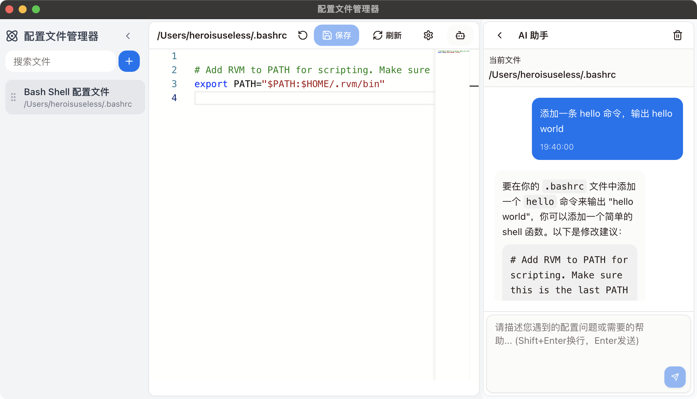

# Config Editor

[中文版](./READMEZH.md)

A modern configuration file manager built with Electron + React + TypeScript, supporting unified management, editing, refreshing, and permission operations for both local and remote configuration files, with a beautiful interface and smooth experience.



## Key Features

- 🌈 Clean and intuitive user interface with light/dark theme support
- 🗂️ Fast management and refreshing of multiple local/remote configuration files
- 🔒 Support for sudo privilege saving and command execution
- 🖥️ One-click file path copying and real-time status monitoring
- ⏰ Configuration file version history management with easy rollback
- 🌍 Automatic scanning of root directory configuration files with smart recommendations
- 🤖 Built-in AI assistant for intelligent analysis and editing assistance
- 🛠️ Support for custom refresh commands, adaptable to various scenarios
- 🧩 Support for drag-and-drop sorting, searching, and batch management

## Quick Start

### Requirements
- Node.js 16+
- Recommended to use [VSCode](https://code.visualstudio.com/)

### Install Dependencies

```bash
# Recommended to use cnpm or yarn
cnpm install
# or
yarn install
```

### Start Development Environment

```bash
yarn dev
```

### Build

```bash
# Windows
yarn build:win
# macOS
yarn build:mac
# Linux
yarn build:linux
```

## Usage Guide

1. Click the <kbd>+</kbd> button in the left panel to add local or remote configuration files
2. Support for filling in remote host information with automatic connection testing
3. Edit files directly after selection, use the top toolbar to save/refresh
4. Support for custom refresh commands, compatible with nginx, apache, and other configurations
5. Automatic sudo password prompt when permissions are required
6. Support for AI assistance, debug logging, theme switching, and other advanced features

## Remote File Support
- Support for SSH protocol, requiring host, port, username, and password
- Support for remote reading, saving, and command execution
- Secure and reliable remote operations with detailed failure notifications

## AI Assistant
- Support for multiple large models including OpenAI, Azure, etc.
- Customizable API Key, model, and BaseUrl
- Intelligent analysis of configuration content, assistance in generating/optimizing configurations

## Contributing & Feedback

- Welcome to submit Issues or PRs
- GitHub: https://github.com/heroisuseless/configeditor


## License

MIT License
