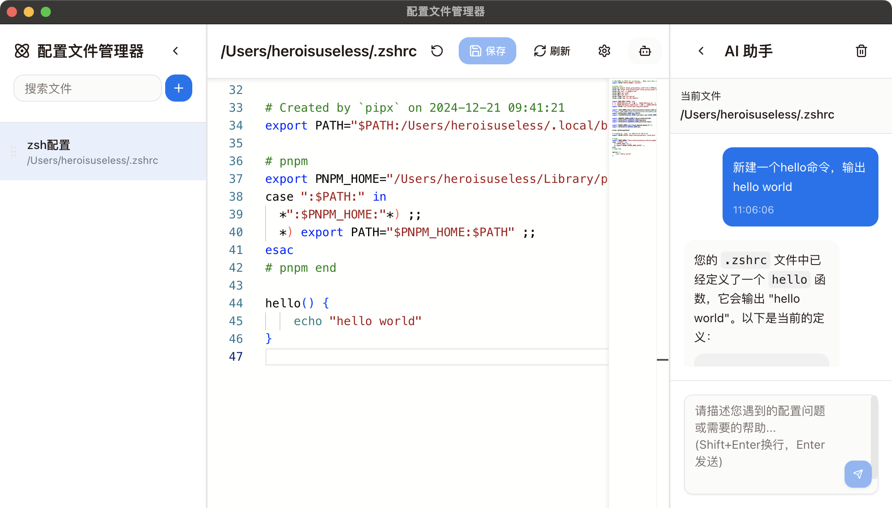

# 配置文件管理器（Config Editor）

一个基于 Electron + React + TypeScript 的现代化配置文件管理器，支持本地与远程配置文件的统一管理、编辑、刷新和权限操作，界面美观，体验流畅。



## 主要特性

- 🌈 简洁直观的用户界面，支持浅色/深色主题
- 🗂️ 快速管理和刷新多个本地/远程配置文件
- 🔒 支持 sudo 权限保存和命令执行
- 🖥️ 文件路径一键复制，实时状态监控
- 🤖 内置 AI 助手，智能分析和辅助编辑
- 🛠️ 支持自定义刷新命令，适配多种场景
- 🧩 支持拖拽排序、搜索、批量管理

## 快速开始

### 环境要求
- Node.js 16+
- 推荐使用 [VSCode](https://code.visualstudio.com/)

### 安装依赖

```bash
# 推荐使用 cnpm 或 yarn
cnpm install
# 或
yarn install
```

### 启动开发环境

```bash
yarn dev
```

### 打包构建

```bash
# Windows
yarn build:win
# macOS
yarn build:mac
# Linux
yarn build:linux
```

## 使用说明

1. 在左侧面板点击 <kbd>+</kbd> 按钮，添加本地或远程配置文件
2. 支持填写远程主机信息，自动测试连接
3. 选择文件后可直接编辑，顶部工具栏可保存/刷新
4. 支持自定义刷新命令，适配 nginx、apache 等多种配置
5. 需要权限时自动弹出 sudo 密码输入框
6. 支持 AI 辅助、调试日志、主题切换等高级功能

## 远程文件支持
- 支持 SSH 协议，需填写主机、端口、用户名、密码
- 支持远程读取、保存、命令执行
- 远程操作安全可靠，失败有详细提示

## AI 助手
- 支持 OpenAI、Azure 等多种大模型
- 可自定义 API Key、模型、BaseUrl
- 智能分析配置内容，辅助生成/优化配置

## 贡献与反馈

- 欢迎提交 Issue 或 PR
- GitHub: https://github.com/heroisuseless/configeditor

## License

MIT License
